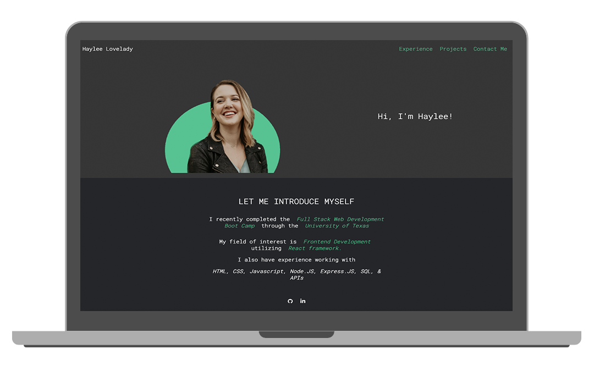

# My React Portfolio

## Description

This is a portfolio for my work thus far in bootcamp built in the form of a react application. 

## Table of Contents
 

- [Installation](#installation)
- [Usage](#usage)
- [License](#license)
- [Mockup](#example)


## Installation
1. Install dependencies using ``npm i`` command in your terminal
2. Run ``` npm start ``` in your terminal to launch the react application on http://localhost:3000/
<br>
<br>
This application is also deployed via Github pages.


## Usage

This is a simple portfolio built using react. 

## License

No license used in this application

## Mockup



## Credits

Clicking [this link](https://react-portfolio-oavba3j9r-hlovelady.vercel.app/#home) will bring you to my deployed React Portfolio.
<br>
Clicking [this link](https://github.com/HLovelady/React-Portfolio) brings you to this GitHub Repository. 

## Tests

No tests were performed in the creation of this application. appPhoto.png
 
## Questions

Send questions to [this e-mail](hfayelovelady@gmail.com).